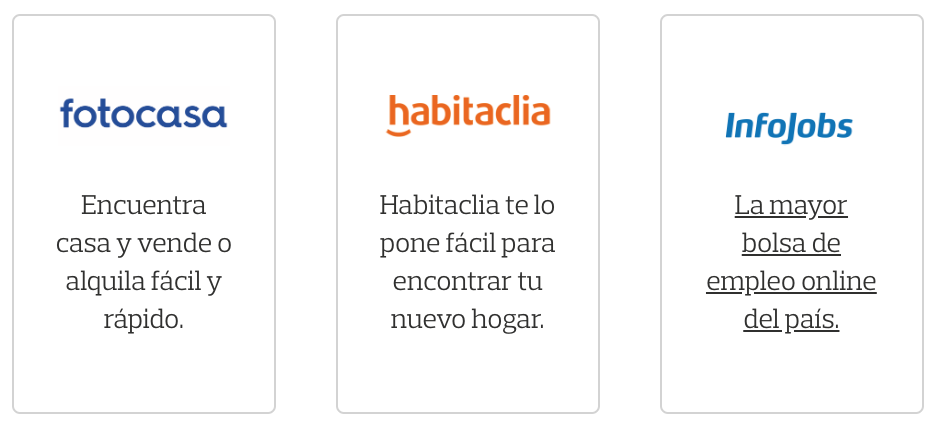
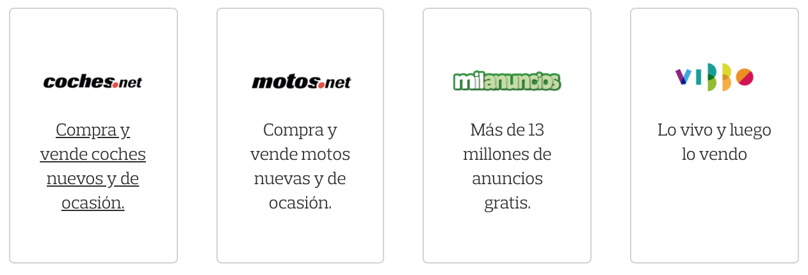
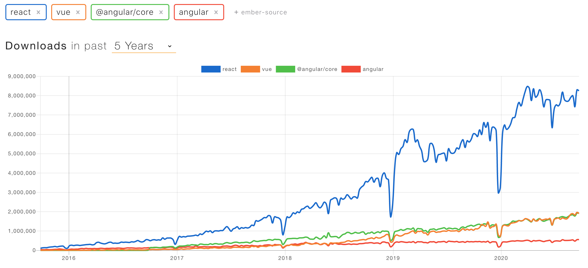
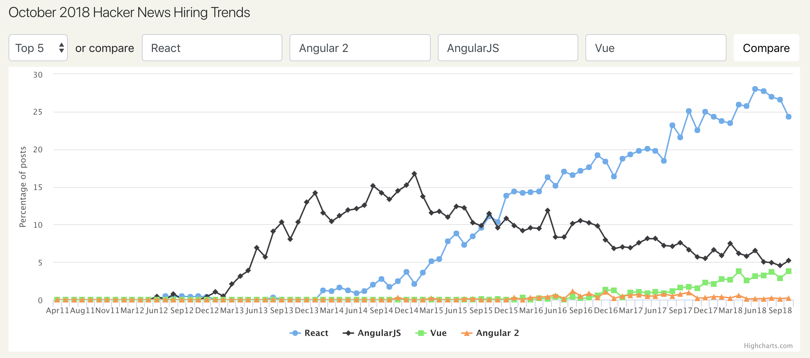
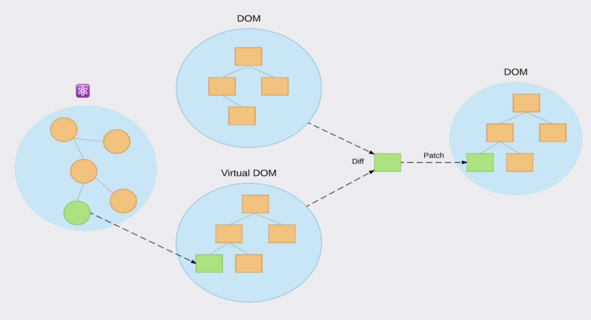

export { default as theme } from './theme'
import { Head } from 'mdx-deck'

<Head>
  <title>KickOffReact por @midudev</title>
</Head>


🤔
---

<div
  style={{
    alignItems: 'center',
    display: 'flex',
    width: '100vw',
    height: '100vw',
    backgroundColor: '#fff'
  }}>
  <div>
    <h3>¿Qué tienen en común<br />todos estos productos y empresas?</h3>
    
  </div>
</div>

---
#### 🤑 ¡Qué tienen mucho money!


---
## Cierto. Pero hay más... 🧐

---
## Todos usan React ⚛️
---
## ¿Y qué es React?
---

import {ProposalTitle} from './components/ProposalTitle'
import {ReactLogo} from './components/ReactLogo'

<ReactLogo />

# &lt;KickOffReact /&gt;

import {Author} from './components/Author.js'

<Author />

---


---
<div
  style={{
    alignItems: 'center',
    justifyContent: 'center',
    display: 'flex',
    width: '100vw',
    height: '100vw',
    backgroundColor: '#fff'
  }}>
  <div>
    <div></div>
    <div></div>
  </div>
</div>

---
## 😳 pero...
## ¿no habías venido a hablar de React?
<ReactLogo />

---
<ReactLogo />

### librería Javascript<br />para construir interfaces de usuario

---

<ReactLogo />

#### librería Javascript<br />para construir interfaces de usuario
### rápidas 🏃‍♂️ y dinámicas ⚡️

---
## No es...
### ~~un lenguaje 💬~~ 
### ~~una herramienta 🔨~~
### ~~un framework 🛠~~

---
## La pregunta del millón 💰
# ¿Por qué debería aprenderlo?
---

### 1️⃣  Por su popularidad


###### https://www.npmtrends.com/react-vs-vue-vs-@angular/core-vs-angular
---

### 2️⃣  Oportunidades laborables


###### https://www.hntrends.com/2018/oct-react-holds-off-python.html?compare=React&compare=Angular+2&compare=AngularJS&compare=Vue

---

### 3️⃣  Presente brillante 🌟<br />Futuro prometedor 🚀


###### https://conf.reactjs.org/

---
## Ahora...<br />¿queréis saber más de React?
<ReactLogo />

---


### fue creado por Facebook
### para simplificar formularios de Ads
### y evitar ataques XSS 🏴‍☠️
---


### De código abierto desde mayo del 2013
##### 😱 usado en producción desde 2011

---
# Los tres pilares de React 🏛
---
## 1️⃣ React es declarativo<br /><br />

### no le decimos CÓMO a base de instrucciones
### le describimos el QUÉ esperamos

---


### declarativo 🆚 imperativo
### para cenar sushi

---
# Imperativo
## Coge tu móvil. 📱 Marca el teléfono del restaurante. 📲. Pide dos nigiris y dos uramakis. 🍣 Dile tu dirección. 🏠 Espera 20 minutos. ⏲ Atiende la puerta. 🚪 Paga al repartidor. 💵 No seas ratilla, dale propina. 🐀 Lleva la bolsa con la cena al comedor y ábrela. 🛍 Situa la comida en la mesa. 🍱 Coge los palillos. Cogelos bien. Bueno, pues coge un tenedor. 🍴 Come. 🤭

---
# Declarativo
## Quiero cenar sushi. 🥺🍣

---
### ejemplo de código Javascript imperativo
```javascript
const container = document.getElementById(‘container’)
const btn = document.createElement(‘button’)
btn.className = ‘btn red’
btn.onclick = function(event) {
 if (this.classList.contains(‘red’)) {
   this.classList.remove(‘red’)
   this.classList.add(‘blue’)
 } else {
   this.classList.remove(‘blue’)
   this.classList.add(‘red’)
 }
}
container.appendChild(btn)
```
---
## 2️⃣ React está basado en componentes<br /><br />

### separamos nuestra interfaz en pequeñas partes
### que la hacen sencilla, predictiva y reusable

---

---
### mobile.twitter.com con React

---
## 3️⃣ React está muy bien optimizado
### sólo renderiza los cambios necesarios

---
### La magia 🧙‍♀️ del Virtual DOM


---


---
# Los tres pilares de React 🏛
## 1️⃣ es declarativo
## 2️⃣ está basado en componentes
## 3️⃣ bien optimizado

---


---
## Tu primer componente

```javascript
function Hello () { // un componente es una función! 👀
  return React.createElement(
    'h1', // elemento a renderizar
     null, // atributos del elemento
    'Hola Mundo 👋🌍!' // contenido del elemento
  )
}
```
---
## Una web con React en un minuto ⏲
### sin Webpack, sin Babel, sin nada
### sólo un archivo index.html. Old school! 👨‍🦳
---
## Primero, cargaremos la librería
```html
<script
  src="https://unpkg.com/react@16/umd/react.development.js"
  crossorigin
></script>
<script
  src="https://unpkg.com/react-dom@16/umd/react-dom.development.js"
  crossorigin
></script>
```
---
## Después, crearemos un div con un identificador
### donde renderizaremos nuestro componente
```html
<div id="contenedor-app"></div>
```
---
## Añadimos nuestro primer componente
```html
<script>
  function Hello () {
    return React.createElement(
      'h1', // elemento a renderizar
      null, // atributos del elemento
      'Hola Mundo 👋🌍!' // contenido del elemento
    )
  }
</script>
```
---
## Renderizamos nuestro componente en la página
## usando ReactDOM
```html
<script>
  ReactDOM.render(
    React.createElement(Hola), // el elemento a renderizar
    document.getElementById("contenedor-app") // dónde lo renderizamos
  );
</script>
```
---
## ¡Live coding! 👨‍💻


##### ¡Vamos a hacerlo funcionar!

<a href='https://codesandbox.io/s/9ypq6rk29p' target='_blank' rel='noopener'>Code Sandbox</a>
---
## Observaciones 👀
### ¡Qué feo tener que escribir React.createElement!
### y si tuvieramos que añadir más niveles...

---
```javascript
function Hello() {
  return React.createElement(
    "div",
    null,
    React.createElement(
      "h1",
      null,
      React.createElement(
        "span",
        null,
        "Hola"
      ),
      " Mundo"
    )
  )
}
```
---


#### Vuestra cara en estos momentos 🤦‍♀️
---
# ¡JSX al rescate! 🦸‍♀️

---
## Tu primer componente con JSX
```javascript
function Hello () {
  return <h1>Hola Mundo 👋🌍!</h1>
}
```
---
## JSX es azucar sintáctico * 🍨
### · creada por Facebook
### · extiende Javascript para su uso con React
### · NO ES HTML!<br />

###### * añadidos a la sintaxis de un lenguaje de programación<br />diseñados para hacer algunas construcciones más fáciles de leer o expresar.
---
## Comparación con y sin JSX
```javascript
function Hello () { // con jsx
  return <h1>Hola Mundo 👋🌍!</h1>
}

function Hello () { // sin jsx
  return React.createElement(
    'h1',
    null,
    'Hola Mundo 👋🌍!'
  )
}
```
#### ambas, son lo mismo
---
## Revisemos en tiempo real 🕵️‍♂️
<a rel='noopener' target='_blank' href='https://babeljs.io/en/repl.html#?babili=false&browsers=&build=&builtIns=false&spec=false&loose=false&code_lz=GYVwdgxgLglg9mABACQKYBt10QCgJSIDeAUIogE6pQjlIA8AJjAG4B8dAFgIzsDOADgEMwrZHHSC6AegHDWiALLgGcad3ZSmbYgF9EQA&debug=false&forceAllTransforms=false&shippedProposals=false&circleciRepo=&evaluate=false&fileSize=false&timeTravel=false&sourceType=module&lineWrap=true&presets=es2015%2Creact%2Cstage-2&prettier=false&targets=&version=6.26.0&envVersion='>Babel REPL</a>
---
## ¡Live coding! 👨‍💻


##### Crear componente `<RandomAvatar size='100' />`
<a href='https://codesandbox.io/dashboard/recent' target='_blank' rel='noopener'>Code Sandbox</a>

---
## Todavía quedan muchas cosas...
### state, prop-types, renderizado condicional
### eventos, listas, formularios, Fragments
### children, composición, render props,
### ¡y mucho más!

---
# Dos cositas más... ✌️
---
import {EjemploReact} from './components/EjemploReact'

##  1️⃣ Esta presentación usa React
<EjemploReact />

###### revisar el Virtual DOM en acción 👀
---
### Código fuente disponible 👇
https://github.com/miduga/kick-off-react

---
## Y gracias a Infojobs
### sólo por hoy...
---

## 💸 👨‍🏫 ⚛️
## 2️⃣ ¡Gratis el curso para aprender React en Udemy!
http://bit.ly/react-gratis

---
# ¡Gracias! 🙇‍♂️
### ¿Alguna pregunta?
## <br />
#### Curso 💸 👨‍🏫 ⚛️<br />http://bit.ly/react-gratis
